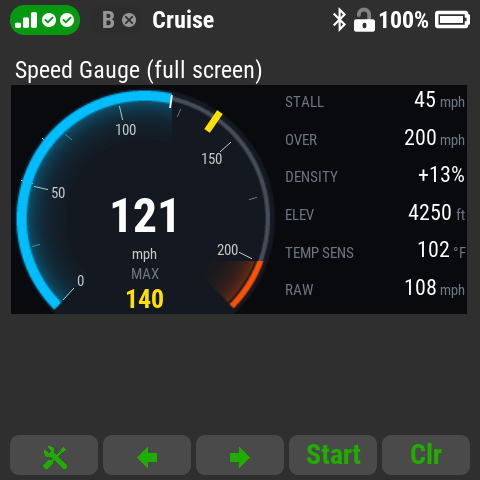
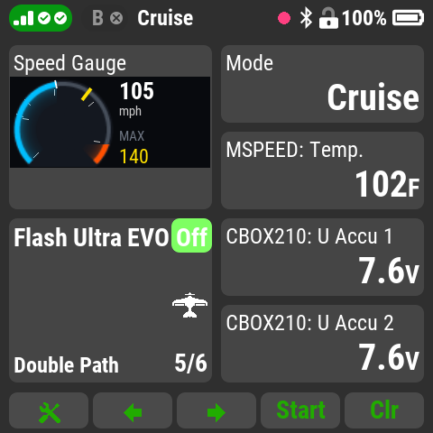
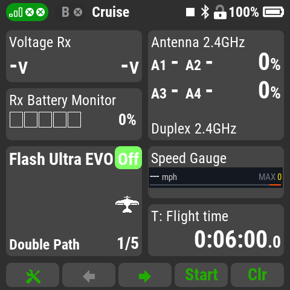
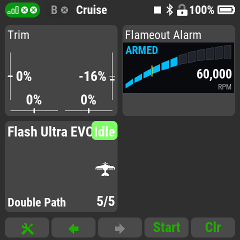
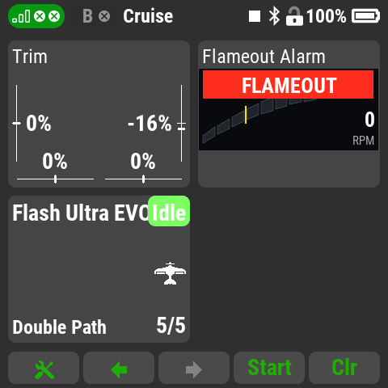
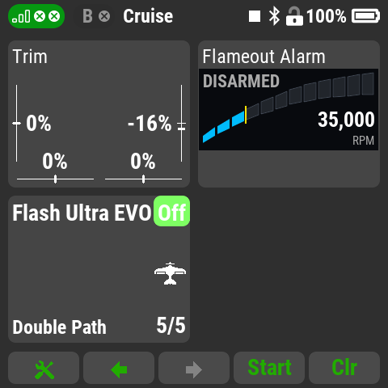

# Jeti Lua Apps

A collection of Lua apps for the JETI DS-24 II transmitter, built with a
spec-driven workflow (GitHub Spec Kit + Claude Code) in VS Code.

## Apps

| App | Script | Status | Spec | Based on |
| --- | --- | --- | --- | --- |
| Speed Gauge | [`AG-SpdGa.lua`](src/Apps/AG-SpdGa.lua) | Released (0.3.0) | [001](specs/001-speed-gauge/spec.md) | DFM Speed Announcer by Dave McQueeney (MIT) |
| Flameout Alarm | [`AG-FlmOt.lua`](src/Apps/AG-FlmOt.lua) | Released (0.1.0) | [003](specs/003-flameout-alarm/spec.md) | Original |

### Screenshots

Taken on a DS-24 II transmitter.

**Speed Gauge:** full screen at 121 mph, double size, single size





**Flameout Alarm:** armed at 60,000 RPM, flameout alarm, disarmed





### Speed Gauge

Speaks your model's airspeed, warns of stall and overspeed, and shows a
speedometer on the main screen. It is based on Dave McQueeney's DFM Speed
Announcer, with its callout timing and warnings kept and a gauge, air density
correction and a new voice added. It only listens and informs: it never
controls the model.

It works with a pitot airspeed sensor such as the JETI MSpeed (anything that
reports speed as a telemetry value), or with GPS speed. With GPS the warnings
use ground speed, so wind shifts them, and there is no air density
correction.

**Setup** (Applications → Speed Gauge):

- **Speed sensor**, **sensor type** (airspeed or GPS) and **units** (mph,
  km/h, knots, m/s or ft/s). Every speed setting follows the units, and
  changing them converts the values.
- A **callouts on/off switch**, and optionally a **continuous callouts
  switch**. Either switch also turns on the warnings; with both off the app
  is silent, but the gauge and max speed keep working.
- Your model's **landing**, **stall** and **overspeed** speeds, entered as
  the model's sea-level values. The settings flag an illogical order (stall
  must be below landing, landing below overspeed).
- **Gauge max limit**: the top of the dial. Set it to your sensor's top
  speed to use its whole range (MSpeed: 350 km/h / 215 mph; MSpeed 450 EX:
  450 km/h / 280 mph). 0 = auto: overspeed + 15%.

Callouts:

- In a clear voice ("eighty five miles per hour"). The interval runs from
  the **shortest** (default 2 s) to the **longest** time (default 40 s) and
  gets shorter the more the speed has changed since the last callout,
  relative to the **callout sensitivity** (default 10 mph): a steady speed
  is spoken every 40 s, a 10 mph change after about 20 s.
- Nothing is spoken until the model first passes **Callouts start above**
  (default 30 mph). After that callouts stay on for the session, so they
  continue on approach. No callout is ever spoken below 5 mph.
- **Landing speed callouts** (on by default): once the model has been above
  landing speed, slowing below it gives short number-only callouts every
  shortest time.
- The **continuous switch** gives number-only callouts every shortest time
  while above "Callouts start above", with or without the on/off switch.
- **Max speed** ("max 201 miles per hour") is called about 1 s after each
  new peak, if it beats the last announced max by at least the callout
  sensitivity. The max resets at every start-up and with **Reset max
  speed**.
- A callout never starts while another is still playing.

Warnings, with stick vibration:

- **Stall** when the speed drops to the stall setting, but only after the
  model has first exceeded landing speed (so not on the ground). At most
  twice per slowdown; it re-arms above landing speed, e.g. after a
  go-around.
- **Overspeed** once each time the speed passes the overspeed setting.
- **"Airspeed alive"** once, when the model first passes "Callouts start
  above".

The gauge:

- **Single size:** current speed, max, and a speed bar with the overspeed
  zone. **Double size:** a small dial beside the speed and max. **Full
  screen** ("Speed Gauge (full screen)"): a large dial with a numbered
  scale, max in the dial, and rows for stall, overspeed, air density,
  elevation, temperature and the uncorrected sensor speed.
- The dial's arc shows the current speed (overspeed color past the limit);
  a yellow marker stays at the session max. The colors can be changed.
- The gauge is drawn for the DS-24 II / DC-24 II. On other DC/DS-24
  transmitters the callouts and warnings work, and the window shows a
  notice instead.

**Air density correction** (optional, airspeed sensors only). A pitot
reads low where the air is thin: about 8% at 5,000 ft on a standard day,
more when it's hot. With correction on, the shown and spoken speed, the max
and the overspeed check use true airspeed, from your **field elevation** and
the **temperature**:

- **Standard**: the standard temperature for that elevation;
- **Manual**: today's temperature, typed in;
- **Sensor**: read live from a telemetry temperature, such as the MSpeed's.
  If the reading is lost or out of range (e.g. a sensor heat-soaked in the
  sun), it falls back to standard and the gauge shows "SENSOR OUT"; it
  switches back about 10 s after a good reading returns. A sensor inside a
  warm fuselage can read higher than the outside air.

Stall, landing and "airspeed alive" keep using the sensor's own speed,
because those limits depend on air pressure, not true speed. Leave
correction off if your sensor already corrects for air density.

**Voice.** Speed Gauge speaks in its own voice (Piper "Amy"), in
`src/Apps/AG-SpdGa/voice/`. Those files are licensed CC BY-SA 4.0, not MIT
(see [CREDITS.md](CREDITS.md)); [`tools/voice/`](tools/voice/README.md)
regenerates them. The **Voice** setting switches to the transmitter's own
voice, and without the voice files the app uses that automatically.

Install = `AG-SpdGa.lua`, the `AG-SpdGa/` folder, and `lib/ag_dens.lua` and
`lib/ag_gauge.lua`. Details in [spec 001](specs/001-speed-gauge/spec.md) and
the [description page](docs/apps/speed-gauge.md).

### Flameout Alarm

Watches a turbine's RPM telemetry and sounds an urgent, repeating alarm
("Flameout! Flameout! Flameout!" and a lock tone every 5 seconds, with stick
vibration) when the engine spools down after it has been running. A
double-size window shows RPM as a segmented bar with an idle marker.

**It is advisory only.** It never controls the model or the engine. It does
not replace the ECU's own failsafe, shutdown or auto-restart logic, or the
pilot's own monitoring.

**It only works if the turbine's RPM reaches the transmitter as a normal
telemetry sensor**, i.e. you can pick it in the transmitter's sensor list.
What is known per ECU brand ([research](specs/003-flameout-alarm/research.md#r1-how-ecus-deliver-rpm-to-a-jeti-transmitter)):

| ECU | RPM as a telemetry sensor |
| --- | --- |
| JetCat | Yes, through JetCat's, VSpeak's, Digitech's or CB-Electroniks' Jeti converter |
| Xicoy (V6/V10, also JetsMunt) | Yes, through the Xicoy telemetry adapter (sensor group "Turbine") |
| KingTech | Yes, through the KingTech telemetry unit or a VSpeak/Digitech converter |
| Swiwin | Yes, through VSpeak's Swiwin converter. Direct connection: unconfirmed |
| JetCentral | Unconfirmed: the Telemetry Adapter V2 uses its own Lua app |
| Enjet Power | Unconfirmed |

RPM shown only on a JetiBox screen, or only inside another maker's Lua app,
can't be used. Swiwin users: set the receiver's output period to 11-13 ms,
not "Auto" (a known Swiwin ECU issue, unrelated to this app).

**Setup** (Applications → Flameout Alarm). Monitoring stays off until three
things are set:

- **RPM sensor.** If the ECU sends RPM in units other than RPM (e.g.
  thousands), set **Sensor scale** so **Live RPM** reads true engine RPM.
- **Idle RPM**, typed from the ECU's setup, in thousands (35.0 = 35,000
  RPM). Compare it with **Live RPM** at idle. Too high, and the app arms only
  on a run-up and a relight won't clear the alarm until you open the
  throttle. Too low, and the alarm comes later and a restart clears it
  sooner.
- **Cut switch**, assigned in its Cut (engine off) position. Moving it to Cut
  disarms the app silently and is the only way to silence an alarm.

How it decides:

- A turbine start overshoots idle and slowly settles back down, so the app
  arms on an **arming threshold** below idle (default 90%) held for the
  arming time (3 s). The arming threshold must stay above any RPM the engine
  reaches before it runs on its own; raise the percentage if your engine's
  start or auto-restart comes close to it.
- RPM below the **flameout threshold** (default 70% of idle) for the
  detection delay (1 s) starts the alarm. A throttle chop to idle stays
  above it.
- During an ECU auto-restart the alarm keeps going; it clears once RPM holds
  the arming threshold for the arming time.
- If telemetry stops for the telemetry-loss delay (2 s), the app says "Engine
  telemetry lost" instead of alarming.

A **Test alarm** switch plays the real alarm on the ground (not while armed).
The sounds in `src/Apps/AG-FlmOt/` are generated with
[`tools/voice/make_flameout.py`](tools/voice/README.md) and licensed CC BY-SA
4.0, not MIT. Install = `AG-FlmOt.lua` plus the `AG-FlmOt/` folder.

## Install with JETI Studio

1. In JETI Studio open **File → Configuration**, and add this line to the
   list of Lua app sources:

   ```
   https://raw.githubusercontent.com/Flazzarious/jeti-lua-apps/main/Apps.json
   ```

2. Connect the transmitter by USB. The released apps appear in JETI
   Studio's Lua app list; select one and install it.

Each app installs exactly its released version (its files come from the
release tag). Descriptions: [Speed Gauge](docs/apps/speed-gauge.md),
[Flameout Alarm](docs/apps/flameout-alarm.md) (in JETI Studio once its
`Apps.json` entry is published).

For maintainers: after tagging a release, run
`python tools/publish/make_apps_json.py`, commit `Apps.json` and merge it to
`main`.

Apps here are for telemetry, timers, announcements and displays only. Nothing
in this repo may control surfaces, throttle or any flight function. See the
constitution: [`.specify/memory/constitution.md`](.specify/memory/constitution.md).

## Layout

```
.specify/memory/constitution.md   Rules every spec, plan and task inherits
.luarc.json                       LuaLS config (Lua 5.3, globals are errors)
.vscode/                          Editor settings, recommended extensions
types/jeti.lua                    LuaLS stubs for the Jeti API (v1.5 + notes)
docs/jeti-api-notes.md            The API facts that shape how apps are written
docs/examples/style/HELLO.lua     Style reference app (not deployed)
docs/examples/                    Other reference code, incl. official Jeti demos
docs/vendor/                      Generated full API text (gitignored)
specs/NNN-<feature>/              spec.md, plan.md, tasks.md per feature
src/Apps/                         Mirrors /Apps on the transmitter SD card
  AG-xxxxx.lua                    One script per app
  AG-xxxxx/                       That app's sounds, images, language files
  lib/ag_xxxxx.lua                Shared modules, require("ag_xxxxx")
tools/check.py                    Syntax, forbidden-API, naming, encoding checks
tools/pdf2md.py                   Converts Jeti's API PDF for local reference
tests/test_ag_dens.lua            Optional desktop test for the density module (any Lua 5.3)
tools/probe/PROBE.lua             Dev tool: prints the screen/window sizes in the emulator
```

### Multiple apps, one repo

- **Names.** Every app script is `AG-` plus up to 5 letters or digits, so it
  fits the transmitter's 8.3 limit and stays grouped apart from other
  authors' apps (`DFM-*`, `RCT-*`). The menu name is separate and can be
  anything. A released filename is never changed, because the transmitter
  ties each model's settings for an app to its filename.
- **Shared code** goes in `src/Apps/lib/` as `ag_xxxxx.lua`. One copy is loaded
  and shared by every app, so modules hold no state of their own.
- **Specs are per feature, not per app.** A new app and a later change to an
  existing app each get the next number in `specs/`.
- **Deploying.** Copy the app's script, its `AG-xxxxx/` folder, and any `lib/`
  modules it uses.

## First-time setup

1. **VS Code extensions.** Open the folder and accept the recommended
   extensions (Lua by sumneko, EditorConfig). LuaLS reads `.luarc.json`, so
   diagnostics also work from the command line and for agents.
2. **Spec Kit.** This repo already contains the constitution. Commit before
   initializing, because `--force` may replace managed files:
   ```bash
   uv tool install specify-cli
   specify init --here --force --integration claude --script ps
   git diff .specify/memory/constitution.md   # restore with git checkout if replaced
   ```
3. **Full API reference (optional, recommended for agents).**
   ```bash
   pip install pypdf
   python tools/pdf2md.py
   ```
   This writes `docs/vendor/jeti-api.md`. It's gitignored because the PDF is
   JETI's copyrighted document.
4. **Lua 5.3 compiler (optional).** `tools/check.py` uses `luac5.3`/`luac` from
   PATH for syntax checks and skips that step with a warning if absent.

## Workflow

1. `/speckit-specify`, `/speckit-plan`, `/speckit-tasks`, `/speckit-implement`
   for each feature under `specs/`.
2. Implement in `src/Apps/` following the naming rules above.
3. `python tools/check.py` must pass. LuaLS must show no errors.
4. Run in the JETI Studio DS-24 II emulator: copy the app into
   `%LOCALAPPDATA%\JETI-Studio\Emulator\Apps`. For sensors, use LeonAirRC's
   [Emulator Telemetry](https://github.com/LeonAirRC/Jeti-Lua-Apps) app.
   Remember the emulator has `os`, `debug` and `coroutine`; the radio does not.
5. Copy the app to `/Apps` on the transmitter's SD card (it mounts as USB mass
   storage). Optionally ship `.lc` bytecode compiled by the matching
   firmware/emulator version; `.lc` files are never committed.
6. First real run on a dedicated test model.

## Branching

| Branch | From | Merges into | Holds |
| --- | --- | --- | --- |
| `main` | | | Released versions only. Every commit is a release, tagged |
| `develop` | `main` | `main`, by pull request only | Finished features waiting for a release |
| `feature/NNN-name` | `develop` | `develop`, by pull request | One spec's work, e.g. `feature/001-speed-gauge` |

`main` is updated **only** by a pull request from `develop`; GitHub enforces
this (a ruleset on `main` and the `PR source is develop` check in
`.github/workflows/main-pr-source.yml`). Version bumps and last fixes happen
on the feature branch or on `develop` before that pull request; there are no
release or hotfix branches.

- A feature branch uses the same `NNN-name` as its `specs/` folder, and
  carries that spec from `/speckit-specify` through `/speckit-implement`.
- Merge a feature into `develop` only after `tools/check.py` passes and the
  quickstart's emulator scenarios have been run.
- Tag releases on `main` as `<script>-v<version>`, e.g. `AG-SpdGa-v1.0.0`,
  matching the app's `version` field. Each app has its own version.
- Never commit directly to `main` or `develop`.

## Style reference: HELLO.lua

`docs/examples/style/HELLO.lua` is a small flight timer started by a
user-assigned switch. It is not deployed, but `check.py` and LuaLS still check
it. It demonstrates the conventions every app follows: lifecycle, a settings
form, `pSave`/`pLoad`, a telemetry window, rate-limited `loop()` and cached
display strings.

## API coverage

`types/jeti.lua` follows the JETI DC/DS Lua API v1.5 (December 2019). DS-24 v2
firmware may add functions that aren't in it. Entries marked `UNVERIFIED` were
inferred where the PDF is silent. When a newer API document turns up, update
the stubs and `docs/jeti-api-notes.md` together.

## Credits

Speed Gauge is based on **DFM Speed Announcer** by DFM (Dave McQueeney),
[github.com/davidmcq137/JetiLuaDFM](https://github.com/davidmcq137/JetiLuaDFM).
Much of its behavior comes from that app, and this rewrite wouldn't exist
without it. See [CREDITS.md](CREDITS.md) for all credits and license notices,
including JETI's demos.

## License

MIT. See [LICENSE](LICENSE). Anyone may use, modify and share these apps, as
long as they keep the copyright and license notice. Apps derived from other
people's work also carry those authors' notices, listed in
[CREDITS.md](CREDITS.md). Third-party code copied unmodified into
`docs/examples/` (JETI's demos, DFM Speed Announcer) keeps its own license,
stated in each file.

## References

- Official apps and demos: https://github.com/JETImodel/Lua-Apps
- Community apps and emulator telemetry: https://github.com/LeonAirRC/Jeti-Lua-Apps
- Best practices: https://www.rc-thoughts.com/2016/09/lua-for-jeti-considerations-and-best-practices/
- Lua 5.3 manual: https://www.lua.org/manual/5.3/
